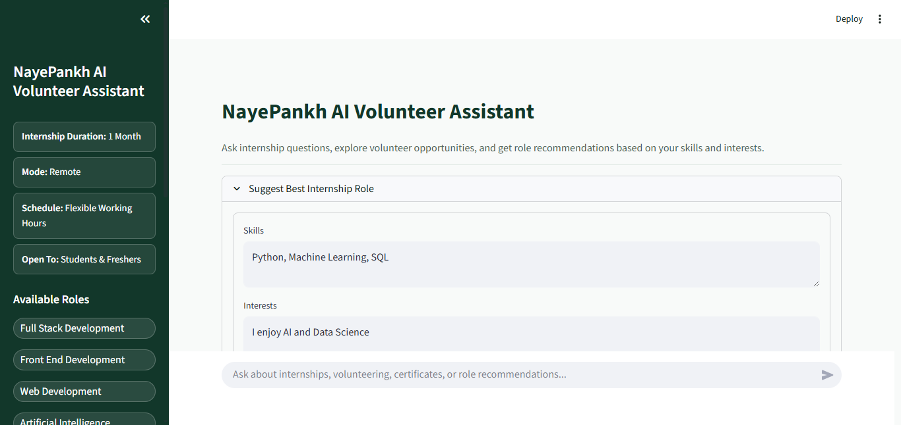
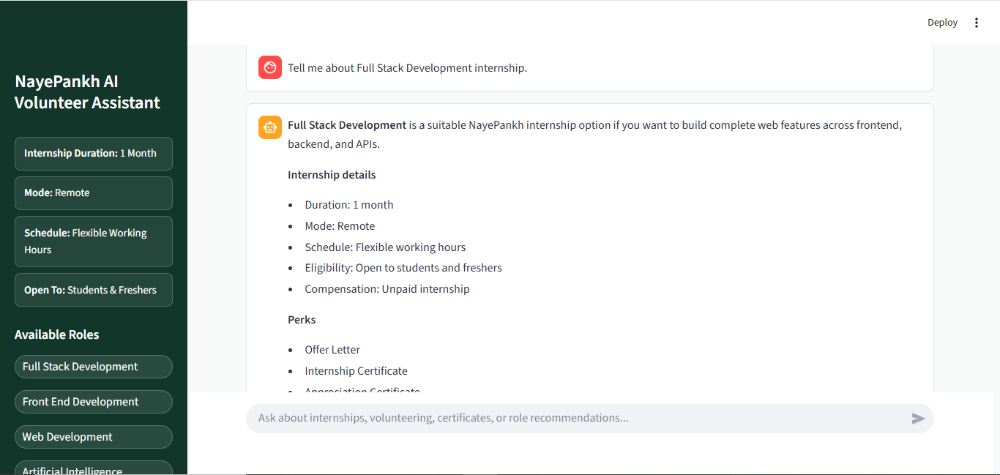
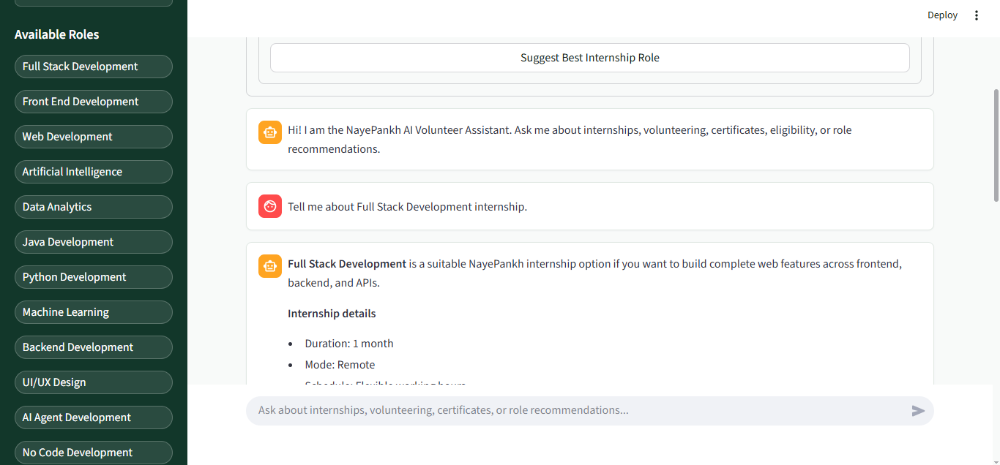
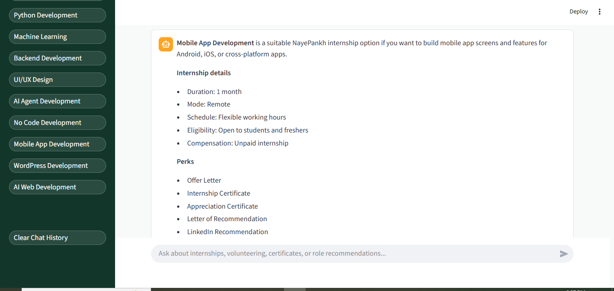

# NayePankh AI Volunteer Assistant

An AI-powered assistant built with Python, Streamlit, and Google Gemini 2.5 Flash to help students and volunteers explore NayePankh Foundation internship opportunities, receive personalized role recommendations, and get answers to common internship questions.

This project was developed for an AI Agent Development Internship submission and demonstrates:

- AI agent development
- LLM integration
- Session memory
- Prompt engineering
- Knowledge-based question answering
- A practical NGO use case

## Features

### AI Chat Assistant

Users can ask questions such as:

- What internships are available?
- How long is the internship?
- Is it paid?
- What certificates are provided?
- Who can apply?

The assistant answers using the local knowledge base and avoids inventing details that are not present.

### Internship Role Recommendation

Users can enter their skills and interests to receive suitable internship role recommendations, such as AI Agent Development, Artificial Intelligence, Machine Learning, Python Development, Web Development, and more.

### Session Memory

Conversation history is maintained with Streamlit Session State, so the assistant remembers previous messages during the current session.

### Interactive Sidebar

The sidebar displays internship details and available roles. Each role button adds an instant role-specific explanation to the chat.

### Modern Interface

- Wide Streamlit layout
- ChatGPT-style chat experience
- Professional NGO-themed sidebar
- Loading spinner while generating responses
- Responsive, clean UI

## Tech Stack

| Component | Technology |
| --- | --- |
| Frontend | Streamlit |
| Backend | Python |
| LLM | Google Gemini 2.5 Flash |
| Memory | Streamlit Session State |
| Deployment | Streamlit Cloud |

## Project Structure

```text
nayepankh-ai-agent/
|-- app.py
|-- knowledge_base.txt
|-- requirements.txt
|-- README.md
|-- .env.example
|-- .gitignore
`-- assets/
    |-- screenshot-home-role-form.png
    |-- screenshot-full-stack-role.png
    |-- screenshot-chat-role-response.png
    `-- screenshot-sidebar-role-list.png
```

## Installation

Clone the repository:

```bash
git clone https://github.com/hemant2186/nayepankh-ai-agent.git
cd nayepankh-ai-agent
```

Install dependencies:

```bash
pip install -r requirements.txt
```

## Environment Setup

Create a local `.env` file:

```bash
cp .env.example .env
```

Add your Gemini API key:

```env
GEMINI_API_KEY=your_api_key_here
```

Never commit real API keys to GitHub.

## Run Locally

```bash
streamlit run app.py
```

The application will be available at:

```text
http://localhost:8501
```

If that port is busy, run:

```bash
streamlit run app.py --server.port 8502
```

## System Architecture

```text
User
  |
  v
Streamlit UI
  |
  v
Session Memory
  |
  v
Knowledge Base
  |
  v
Gemini 2.5 Flash
  |
  v
Generated Response
```

## How It Works

1. The app loads internship information from `knowledge_base.txt`.
2. User and assistant messages are stored in `st.session_state`.
3. Gemini receives the knowledge base, recent chat history, and the latest user prompt.
4. The assistant generates professional answers grounded in the knowledge base.
5. The role recommender suggests internships based on user skills and interests.
6. Sidebar role buttons provide instant role-specific guidance.

## Screenshots

### Home and Role Recommendation Form



### Interactive Sidebar Role Details



### Chat History With AI Response



### Complete Sidebar Role List



## Deployment on Streamlit Cloud

1. Push this repository to GitHub.
2. Open Streamlit Cloud.
3. Create a new app from `hemant2186/nayepankh-ai-agent`.
4. Set the main file path to:

```text
app.py
```

5. Add this secret in Streamlit Cloud settings:

```toml
GEMINI_API_KEY = "your_gemini_api_key_here"
```

6. Deploy the app.

## Example Questions

- What internship roles are available?
- Is this internship paid?
- What certificates will I receive?
- I know Python and Machine Learning. Which role is suitable for me?
- How can I apply for internships?
- What skills are required for AI Agent Development?

## Future Improvements

- Persistent database storage
- Resume analysis and matching
- Multi-agent architecture
- Volunteer onboarding workflows
- Analytics dashboard
- Multilingual support
- Admin management panel

## Author

**Hemant Kumar**

- Email: [hemantkumar90089h@gmail.com](mailto:hemantkumar90089h@gmail.com)
- LinkedIn: https://www.linkedin.com/in/hemant-kumar-171472210/
- GitHub: https://github.com/hemant2186

## Acknowledgements

- Google Gemini API
- Streamlit
- Python Community
- NayePankh Foundation Internship Program

## Support

If you found this project useful, consider giving the repository a star on GitHub.
